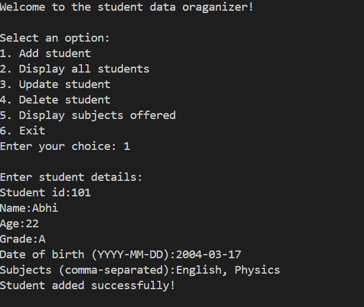
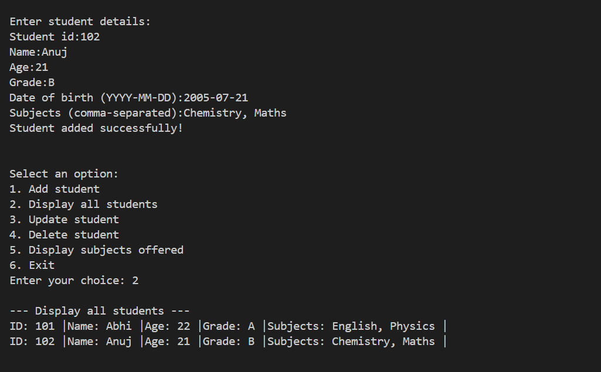
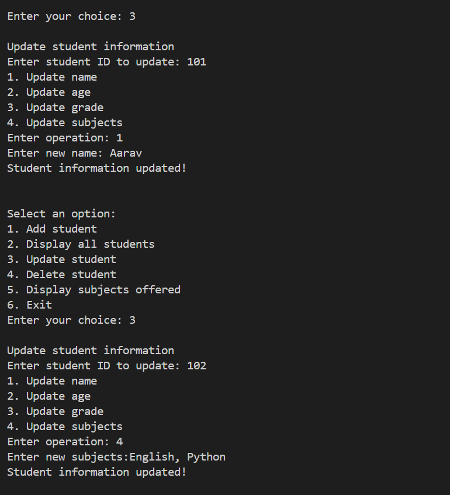
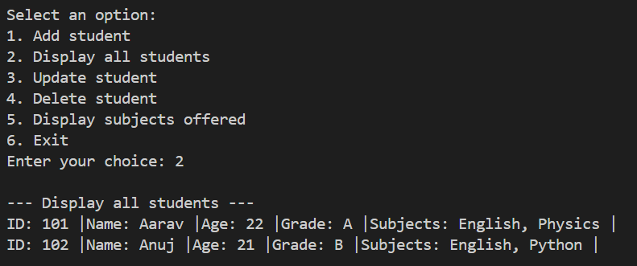
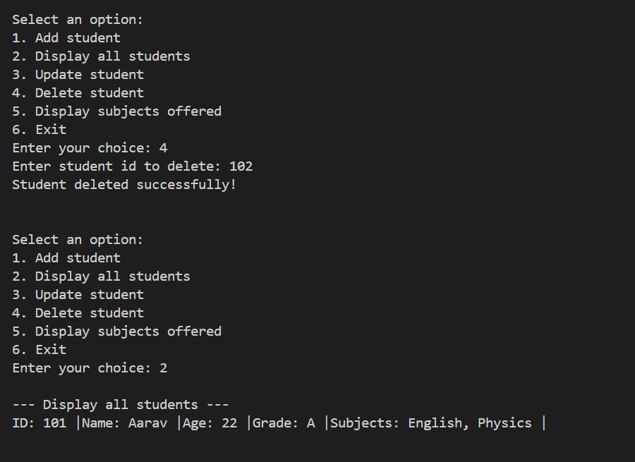
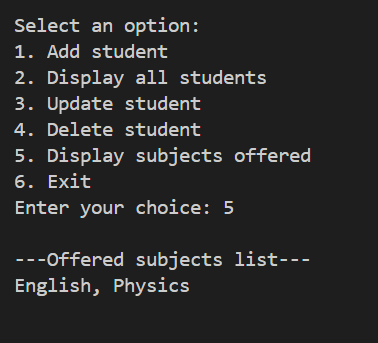

<div align="center">

# 🎓 Student Data Organizer

### *A clean, interactive CLI application to manage student records with ease*

<br>


<br>

> 💡 *Built with pure Python — no libraries needed. A practical project demonstrating CRUD operations, OOP thinking, and clean control flow using modern Python 3.10+ syntax.*

</div>

---

## 📌 Table of Contents

- [✨ Features](#-features)
- [🧠 Tech Concepts](#-tech-concepts)
- [🚀 Getting Started](#-getting-started)
- [🗺️ Program Flow](#️-program-flow)
- [📸 Screenshots](#-screenshots)
- [📁 Project Structure](#-project-structure)

---

## ✨ Features

| # | Feature | Description |
|---|---|---|
| 1 | ➕ **Add Student** | Register students with ID, name, age, grade, DOB, and subjects |
| 2 | 📋 **Display All** | View all student records in a clean formatted list |
| 3 | ✏️ **Update Student** | Modify name, age, grade, or subjects by student ID |
| 4 | 🗑️ **Delete Student** | Remove any student record instantly by ID |
| 5 | 📚 **View Subjects** | See all subjects being studied across all students |
| 6 | 🔄 **Loop Menu** | Menu keeps running until user chooses to exit |

---

## 🧠 Tech Concepts

```python
# ✅ Python 3.10+ match-case — modern structural pattern matching
match choice:
    case 1: add_student()
    case 2: display_all()
    case 3: update_student()
    case _: print("Invalid choice")

# ✅ List of Dictionaries — flexible student data model
student = {
    "Student_id": 101,
    "Name": "Abhi",
    "Age": 22,
    "Grade": "A",
    "Date_of_birth": "2004-03-17",
    "Subjects": "English, Physics"
}

# ✅ Safe in-place deletion
students.remove(stu)
```

| 🔖 Concept | 💡 Used For |
|---|---|
| `list` | Storing all student records dynamically |
| `dict` | Individual student data model |
| `while True` | Persistent menu loop until exit |
| `match-case` | Clean multi-branch control flow |
| `for` + condition | Searching students by ID |
| f-strings | Formatted output display |

---

## 🚀 Getting Started

### ✅ Prerequisites

```bash
python --version   # Must be Python 3.10 or higher
```

### ▶️ Run the App

```bash
# 1. Clone the repository
git clone https://github.com/HarshalVora86/Collection_Manipulator.git

# 2. Navigate into the folder
cd Collection_Manipulator

# 3. Run the program
python pr_3.py
```

> 🎉 No pip install. No setup. Just run and go!

---

## 🗺️ Program Flow

```
┌─────────────────────────────────┐
│        🚀 Program Start         │
└────────────────┬────────────────┘
                 │
                 ▼
┌─────────────────────────────────┐
│         📋 Show Main Menu       │
│  1. Add  2. Display  3. Update  │
│  4. Delete  5. Subjects  6. Exit│
└────────────────┬────────────────┘
                 │
       ┌─────────┴──────────┐
       │    User Choice      │
       └─────────┬──────────┘
                 │
    ┌────────────┼────────────┐
    │            │            │
    ▼            ▼            ▼
┌────────┐  ┌────────┐  ┌────────┐
│➕ Add  │  │📋 View │  │✏️ Edit │
│Student │  │  All   │  │Student │
└───┬────┘  └───┬────┘  └───┬────┘
    │           │            │
    │    ┌──────┴──────┐     │
    │    │ Students    │     │
    │    │ exist? Y/N  │     │
    │    └──────┬──────┘     │
    │           │            │
    └───────────┼────────────┘
                │
    ┌───────────┼────────────┐
    │           │            │
    ▼           ▼            ▼
┌────────┐  ┌────────┐  ┌────────┐
│🗑️ Del  │  │📚 Subj │  │🔚 Exit │
│Student │  │  List  │  │        │
└────────┘  └────────┘  └────────┘
```

---

## 📸 Screenshots

### ➕ Adding a Student
> Registering student Abhi (ID: 101) with grade A and subjects



---

### 📋 Display All Students
> Both students shown in clean formatted output



---

### ✏️ Updating Student Records
> Updating Abhi's name to Aarav and Anuj's subjects to English, Python



---

### 🔁 Verifying Updates
> All changes reflected correctly after update



---

### 🗑️ Deleting a Student
> Student ID 102 deleted — only ID 101 remains



---

### 📚 View Subjects Offered
> All subjects of remaining students listed



---

## 📁 Project Structure

```
📦 Collection_Manipulator/
│
├── 🐍 pr_3.py         ← Main Python script
├── 🖼️ PR_3.png        ← Screenshot: Add student
├── 🖼️ PR_3.1.png      ← Screenshot: Display all
├── 🖼️ PR_3.2.png      ← Screenshot: Update records
├── 🖼️ PR_3.3.png      ← Screenshot: Verify updates
├── 🖼️ PR_3.4.png      ← Screenshot: Delete student
├── 🖼️ PR_3.5.png      ← Screenshot: View subjects
└── 📄 README.md       ← Project documentation
```

---

<div align="center">

### 🌟 If you found this helpful, consider giving it a star!

**Made with ❤️ by [Harshal Vora](https://github.com/HarshalVora86)**


</div>
